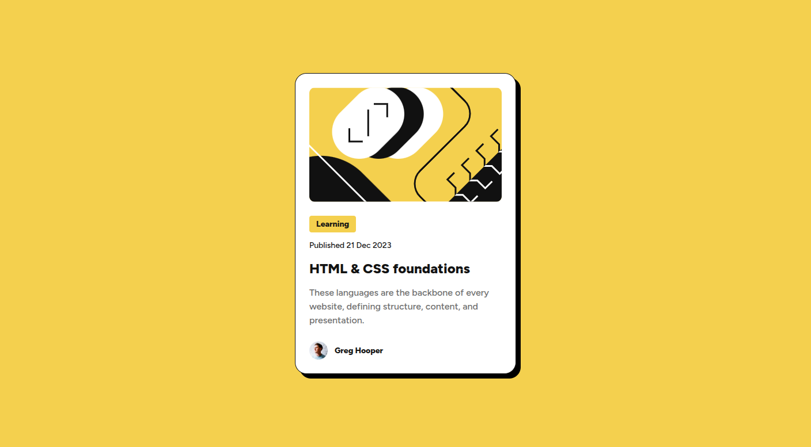

# Frontend Mentor - Blog preview card solution

This is a solution to the [Blog preview card challenge on Frontend Mentor](https://www.frontendmentor.io/challenges/blog-preview-card-ckPaj01IcS). Frontend Mentor challenges help you improve your coding skills by building realistic projects. 

## Table of contents

- [Overview](#overview)
  - [Screenshot](#screenshot)
  - [Links](#links)
- [My process](#my-process)
  - [Built with](#built-with)
- [Author](#author)

## Overview

### Screenshot

### Links

- Solution URL: [https://github.com/michgidev/blog-preview-card.git](https://github.com/michgidev/blog-preview-card.git)
- Live Site URL: [https://michgidev.github.io/blog-preview-card/](https://michgidev.github.io/blog-preview-card/)

## My process

### Built with

- Semantic HTML5 markup
- CSS custom properties
- CSS BEM methodology
- Flexbox
- CSS Grid
- Mobile-first workflow

## Author

- Mich - [@michgidev](https://www.frontendmentor.io/profile/michgidev)